# Architecture

## 范围说明

- 本文档只描述根目录 `src/` 下当前生效的代码结构。
- 已排除工作区内嵌的 `claw-code-agent/` 目录。
- 根目录 `src/` 是源码根，不作为 `src` 包名参与导入；跨目录依赖统一使用顶层绝对导入。

## 当前结构

```text
src/
|- main.py
|- app/
|  |- cli.py
|  |- chat_loop.py
|  |- runtime_builder.py
|  '- query_service.py
|- agent/
|  |- agent.py
|  |- prompt_processor.py
|  |- turn_coordinator.py
|  |- run_limits.py
|  |- delegation_service.py
|  |- result_factory.py
|  '- run_state.py
|- interaction/
|  '- slash_commands.py
|- workspace/
|  |- workspace_gateway.py
|  |- plugin_catalog.py
|  |- policy_catalog.py
|  |- search_service.py
|  '- worktree_service.py
|- context/
|  |- context_manager.py
|  |- budget_projection.py
|  |- snipper.py
|  |- compactor.py
|  '- context_token_estimator.py
|- planning/
|  |- task_runtime.py
|  |- plan_runtime.py
|  '- workflow_runtime.py
|- session/
|- tools/
|  |- tool_gateway.py
|  |- registry.py
|  |- executor.py
|  |- local/
|  '- mcp/
|- openai_client/
'- core_contracts/
```

## 主视图

```mermaid
graph TB
    main(["main.py"])

    subgraph AgentPkg[agent / 运行时门面与主循环]
        a_agent(["agent/agent.py"])
        a_prompt(["agent/prompt_processor.py"])
        a_turn(["agent/turn_coordinator.py"])
        a_limits(["agent/run_limits.py"])
        a_delegate(["agent/delegation_service.py"])
        a_result(["agent/result_factory.py"])
        a_state(["agent/run_state.py"])
    end

    subgraph ControlPlane[app / CLI 与交互循环]
        c_cli(["app/cli.py"])
        c_loop(["app/chat_loop.py"])
        c_build(["app/runtime_builder.py"])
        c_slash(["interaction/slash_commands.py"])
    end

    subgraph QueryFacade[app / 上层查询门面]
        q_service(["app/query_service.py"])
    end

    subgraph ContextPkg[context / 上下文治理]
        x_manager(["context/context_manager.py"])
        x_budget(["context/budget_projection.py"])
        x_snip(["context/snipper.py"])
        x_compact(["context/compactor.py"])
        x_tokens(["context/context_token_estimator.py"])
    end

    subgraph WorkspacePkg[workspace / 工作区能力]
        w_gateway(["workspace/workspace_gateway.py"])
    end

    subgraph Tooling[tools / 工具执行与MCP]
        t_gateway(["tools/tool_gateway.py"])
        t_registry(["tools/registry.py"])
        t_mcp(["tools/mcp/runtime.py"])
    end

    subgraph SessionPkg[session / 会话持久化]
        s_store(["session/session_store.py"])
        s_state(["session/session_state.py"])
        s_snapshot(["session/session_snapshot.py"])
    end

    subgraph Contracts[core_contracts / 共享契约]
        core(["config/protocol/result/usage"])
    end

    main --> c_cli
    c_cli --> a_agent
    c_cli --> c_loop
    c_cli --> c_build

    q_service --> a_agent

    a_agent --> a_prompt
    a_agent --> a_turn
    a_agent --> a_result
    a_agent --> a_delegate
    a_agent --> a_limits
    a_agent --> a_state

    a_turn --> x_manager
    a_turn --> w_gateway
    a_turn --> t_gateway
    a_turn --> t_registry
    a_turn --> t_mcp
    a_turn --> s_state
    a_turn --> s_store

    c_slash --> x_manager

    x_manager --> x_budget
    x_manager --> x_snip
    x_manager --> x_compact
    x_manager --> a_limits
    x_budget --> x_tokens
    x_snip --> x_tokens
    x_compact --> x_tokens

    s_store --> s_snapshot

    a_agent -.-> core
    a_prompt -.-> core
    a_turn -.-> core
    a_limits -.-> core
    a_delegate -.-> core
    a_result -.-> core
    c_cli -.-> core
    c_slash -.-> core
    q_service -.-> core
```



## 当前边界

- `agent/agent.py` (`Agent`) 是唯一对外运行门面，只暴露 `run()` 与 `resume()`。
- `agent/turn_coordinator.py` 只负责 turn loop 编排，不再承载 slash 构造与结果落盘细节。
- `agent/prompt_processor.py` 收口 slash 分流和 prompt 写入前决策。
- `agent/result_factory.py` 收口会话快照落盘与 `AgentRunResult` 构造。
- `agent/run_limits.py` 收口模型前/工具后的预算闸门逻辑。
- `agent/delegation_service.py` 收口 child/group lineage、依赖批处理和汇总。
- `context/context_manager.py` 仍是上下文治理唯一入口，内部组合投影、snip、compact。
- `app/query_service.py` 保持上层 submit/stream/persist 门面，面向 `Agent`。
- `main.py` 仍是薄装配入口。

## 测试镜像

```text
test/
|- app/
|- agent/
|- context/
|- interaction/
|- planning/
|- extensions/
|- session/
|- tools/
|- openai_client/
|- core_contracts/
|- test_main.py
|- test_main_chat.py
|- test_all.py
'- test_release_gate_docs.py
```

- `test/agent/` 覆盖 `Agent` 主循环、`RunLimits`、`DelegationService`、`AgentRunState` 与 context-manager 编排切面。
- `test/app/` 当前覆盖 `QueryService` 上层门面行为与统计语义。
- `test/context/` 覆盖上下文治理组件单测。

## 推荐阅读顺序

1. 先看 `core_contracts/`，建立共享契约层边界。
2. 再看 `agent/`，理解新运行门面的职责拆分。
3. 再看 `context/`，理解 pre-model 与 reactive compact 治理链路。
4. 再看 `tools/` 与 `workspace/`，理解工具与工作区能力如何接入主循环。
5. 最后看 `app/cli.py`、`app/query_service.py` 与 `main.py`，理解控制面装配。