# Architecture

## 范围说明

- 本文档只描述根目录 `src/` 下当前生效的代码结构。
- 已排除工作区内嵌的 `claw-code-agent/` 目录。
- 根目录 `src/` 现在是源码根，不再作为 `src` 包名参与导入；跨目录依赖统一使用顶层绝对导入，如 `from core_contracts.config import AgentRuntimeConfig`。
- 本文档不再重复 project tree 的逐文件结构；重点是先讲清包/模块容器关系，再补少量真正影响理解的跨层依赖。

## 主视图：项目模块架构和依赖关系

逐文件结构请直接看 project tree；下面这张主图把模块分组和关键依赖放在一起，既保留容器关系，也避免把纯转发节点画进去。

```mermaid
%%{init: {
    "theme": "default",
    "themeVariables": {
        "fontFamily": "Times New Roman",
        "fontSize": "20px"
    },
    "flowchart": {
        "curve": "basis",
        "nodeSpacing": 50,
        "rankSpacing": 70
    }
}}%%

graph TB
    accTitle: ClawCodeAgent Module Architecture and Dependencies
    accDescr: Clean layered architecture with minimized edge crossings.

    %% ================= Top =================
    main(["🧭 main.py"])

    %% ================= Control Plane =================
    subgraph ControlPlane [control_plane package / CLI 与本地控制面]
        direction TB
        n_cli(["🧭 control_plane/cli.py"])
        n_slash(["⌨️ control_plane/slash_commands.py"])
        style ControlPlane fill:#f9f9f9,stroke:#333,stroke-dasharray: 5 5
    end

    %% ================= Runtime =================
    subgraph Runtime [runtime package / 主循环编排]
        direction TB
        n_hook_policy_runtime(["🛡️ runtime/hook_policy_runtime.py"])
        n_plugin_runtime(["🧩 runtime/plugin_runtime.py"])
        n_task_runtime(["📋 runtime/task_runtime.py"])
        n_plan_runtime(["🗺️ runtime/plan_runtime.py"])
        n_workflow_runtime(["🧭 runtime/workflow_runtime.py"])
        n_runtime(["⚙️ runtime/agent_runtime.py"])
        style Runtime fill:#f9f9f9,stroke:#333,stroke-dasharray: 5 5
    end

    %% ================= Core Infra（关键：上移） =================
    subgraph External [模型接入]
        direction TB
        n_openai_client(["☁️ openai_client/openai_client.py"])
        style External fill:#f9f9f9,stroke:#333,stroke-dasharray: 5 5
    end

    %% ================= Context（左） =================
    subgraph ContextPkg [context package]
        direction TB
        n_budget_guard(["🛡️ budget_guard.py"])
        n_snip(["✂️ context_snipper.py"])
        n_compact(["🗜️ context_compactor.py"])
        n_token_budget(["🔢 context_budget.py"])
        style ContextPkg fill:#f9f9f9,stroke:#333,stroke-dasharray: 5 5
    end

    %% ================= Tooling（右） =================
    subgraph Tooling [tools package / 工具执行与安全]
        direction TB
        n_tools(["🛠️ tools/agent_tools.py"])
        n_bash_security(["🛡️ tools/bash_security.py"])
        style Tooling fill:#f9f9f9,stroke:#333,stroke-dasharray: 5 5
    end

    %% ================= Session（下） =================
    subgraph SessionPkg [session package]
        direction TB
        n_session_state(["🧠 session_state.py"])
        n_session_store(["💽 session_store.py"])
        n_session_snapshot(["🧾 session_snapshot.py"])
        style SessionPkg fill:#f9f9f9,stroke:#333,stroke-dasharray: 5 5
    end

    %% ================= Contracts（最底） =================
    subgraph Contracts [共享契约层]
        direction TB
        n_core_contracts(["📄 core_contracts/<br/>(config / protocol / usage / result )"])
        style Contracts fill:#f9f9f9,stroke:#333,stroke-dasharray: 5 5
    end

    %% ================= 主链路 =================
    main --> n_cli

    n_cli --> n_runtime
    n_cli --> n_session_store
    n_runtime --> n_slash
    n_runtime --> n_hook_policy_runtime
    n_runtime --> n_plugin_runtime
    n_runtime --> n_openai_client
    n_runtime --> n_tools
    n_runtime --> n_session_state
    n_runtime --> n_session_store
    n_runtime --> n_budget_guard
    n_runtime --> n_snip
    n_runtime --> n_compact

    %% ================= Slash Control Plane =================
    n_slash --> n_session_state
    n_slash --> n_tools
    n_slash --> n_token_budget

    %% ================= 工具 =================
    n_plan_runtime --> n_task_runtime
    n_workflow_runtime --> n_task_runtime
    n_hook_policy_runtime --> n_tools
    n_plugin_runtime --> n_tools
    n_tools --> n_bash_security

    %% ================= Session =================
    n_session_store --> n_session_snapshot

    %% ================= Context =================
    n_budget_guard --> n_token_budget
    n_snip --> n_token_budget
    n_compact --> n_token_budget

    %% ⭐ 关键：缩短跨线（现在是“垂直短边”）
    n_compact --> n_openai_client

    %% ================= Contracts（全部下沉收敛） =================
    main -.-> n_core_contracts
    n_cli -.-> n_core_contracts
    n_runtime -.-> n_core_contracts
    n_hook_policy_runtime -.-> n_core_contracts
    n_plugin_runtime -.-> n_core_contracts
    n_task_runtime -.-> n_core_contracts
    n_plan_runtime -.-> n_core_contracts
    n_workflow_runtime -.-> n_core_contracts
    n_slash -.-> n_core_contracts
    n_tools -.-> n_core_contracts
    n_openai_client -.-> n_core_contracts
    n_session_state -.-> n_core_contracts
    n_session_snapshot -.-> n_core_contracts
    n_budget_guard -.-> n_core_contracts
    n_compact -.-> n_core_contracts

    %% ================= 样式 =================
    style main fill:#343a40,color:#fff,stroke:#1d2124
    style n_cli fill:#6610f2,color:#fff,stroke:#520dc2
    style n_runtime fill:#007bff,color:#fff,stroke:#0056b3
    style n_hook_policy_runtime fill:#198754,color:#fff,stroke:#146c43
    style n_plugin_runtime fill:#0d6efd,color:#fff,stroke:#0a58ca
    style n_task_runtime fill:#20c997,color:#fff,stroke:#0f8f6b
    style n_plan_runtime fill:#ff922b,color:#fff,stroke:#d97706
    style n_workflow_runtime fill:#e8590c,color:#fff,stroke:#c2410c
    style n_slash fill:#8a5cf6,color:#fff,stroke:#6f42c1
    style n_core_contracts fill:#6c757d,color:#fff,stroke:#495057
    style n_openai_client fill:#17a2b8,color:#fff,stroke:#117a8b
    style n_bash_security fill:#ffc107,color:#000,stroke:#d39e00
    style n_session_state fill:#17a2b8,color:#fff,stroke:#117a8b
    style n_session_snapshot fill:#17a2b8,color:#fff,stroke:#117a8b
    style n_session_store fill:#17a2b8,color:#fff,stroke:#117a8b
    style n_token_budget fill:#28a745,color:#fff,stroke:#1e7e34
    style n_budget_guard fill:#28a745,color:#fff,stroke:#1e7e34
    style n_snip fill:#28a745,color:#fff,stroke:#1e7e34
    style n_compact fill:#28a745,color:#fff,stroke:#1e7e34
    style n_tools fill:#fd7e14,color:#fff,stroke:#d9480f
```

这张图把模块分组和关键依赖放在一起：分组框表示模块归属，实线保留主控制流和关键调用链，虚线只表示对 `core_contracts/` 这个共享底座的契约依赖。当前最重要的几个事实是：

- `core_contracts/` 已经成为共享底座，跨模块 dataclass、JSON 协议和配置解析都从这里下沉出去。
- `openai_client/` 现在是源码根下的命名空间目录，不再依赖 `__init__.py`；具体 HTTP 与 SSE 解析仍然集中在 `openai_client/openai_client.py`。
- `context/context_compactor.py` 是少数刻意允许跨层调用客户端的模块，因为它需要主动发起摘要压缩模型请求。
- `main.py` 现在只是极薄的进程入口；真正的 CLI 子命令、chat loop 和控制面装配都下沉到了 `control_plane/cli.py`。
- `runtime/hook_policy_runtime.py` 在主循环启动前扫描工作区内的 `.claw/policies*.json` manifest，负责合并 deny 规则、safe env 与 budget override；在 tool loop 内还会提供 policy block 决策和 before/after hook 注入描述。
- `runtime/plugin_runtime.py` 在主循环启动前扫描工作区内的 `.claw/plugins*.json` manifest，注册 alias/virtual tool，并产出可供 `/tools` 渲染的插件摘要；在 tool loop 内还可为插件提供 before/after hook 与 block 规则。
- `runtime/task_runtime.py` 是独立的工作区本地任务状态机，负责 `.claw/tasks.json` 的持久化、合法状态流转、依赖阻塞/释放与 actionable next tasks 选择；当前已作为 `plan_runtime` 的同步目标。
- `runtime/plan_runtime.py` 负责 `.claw/plan.json` 的持久化、计划渲染，以及把 `PlanStep` 列表同步到 `TaskRuntime`；它不直接接入 agent 主循环，后续主要由 plan/workflow/control-plane issue 消费。
- `runtime/workflow_runtime.py` 负责发现 `.claw/workflows*.json` manifest，顺序执行一组 Task Runtime 操作，并把运行历史写入 `.claw/workflow_runs.json`；它当前聚焦本地顺序执行和可诊断历史记录，不做分布式调度。
- `control_plane/slash_commands.py` 作为本地控制面，挂在 `runtime/agent_runtime.py` 前面做 prompt 预分流；它读取 session、tool registry 与 token 预算投影，但不会触发模型调用。

## 推荐阅读顺序

1. 先看 `core_contracts/`，建立共享契约层与配置/协议对象的边界感。
2. 再看 `openai_client/openai_client.py` 与 `tools/agent_tools.py`，理解模型侧和工具侧两个外部交互面。
3. 再看 `session/` 与 `context/`，理解状态恢复、预算治理、snip、compact 的局部职责。
4. 再看 `runtime/task_runtime.py`、`runtime/plan_runtime.py`、`runtime/workflow_runtime.py`、`runtime/hook_policy_runtime.py`、`runtime/plugin_runtime.py` 与 `runtime/agent_runtime.py`，理解工作区 task/plan/workflow/policy/plugin 如何各自管理状态、同步关系、运行历史、预算、工具注册和 tool loop 行为。
5. 再看 `control_plane/slash_commands.py` 与 `control_plane/cli.py`，理解 CLI 子命令、chat loop 和本地控制面如何装配到 runtime 上。
6. 最后看 `main.py`，确认顶层进程入口只是一个薄包装层。
