# Architecture

## 范围说明

- 本文档只描述根目录 `src/` 下当前生效的代码结构。
- 已排除工作区内嵌的 `claw-code-agent/` 目录。
- 根目录 `src/` 是源码根，不作为 `src` 包名参与导入；跨目录依赖统一使用顶层绝对导入。
- 本轮重构后，旧 `runtime/` 与预算相关旧 `context` 入口不再作为稳定导入路径保留。

## 当前结构

```text
src/
|- main.py
|- interaction/
|  |- command_line_interaction.py
|  '- slash_commands_interaction.py
|- orchestration/
|  |- agent_manager.py
|  |- budget_context_orchestrator.py
|  |- query_engine.py
|  '- local_agent.py
|- workspace/
|  |- workspace_gateway.py
|  |- plugin_catalog.py
|  |- policy_catalog.py
|  |- search_service.py
|  '- worktree_service.py
|- planning/
|  |- task_runtime.py
|  |- plan_runtime.py
|  '- workflow_runtime.py
|- budget/
|  '- budget_guard.py
|- context/
|  |- context_token_estimator.py
|  |- context_token_budget_evaluator.py
|  |- context_snipper.py
|  '- context_compactor.py
|- session/
|- tools/
|- openai_client/
'- core_contracts/
```

## 主视图

```mermaid
%%{init: {
    "theme": "default",
    "themeVariables": {
        "fontFamily": "Times New Roman",
        "fontSize": "20px"
    },
    "flowchart": {
        "curve": "basis",
        "nodeSpacing": 50,
        "rankSpacing": 70
    }
}}%%

graph TB
    accTitle: ClawCodeAgent Module Architecture and Dependencies
    accDescr: Clean layered architecture with package boundaries for control plane, orchestration, workspace, planning, budget and context.

    main(["🧭 main.py"])

    subgraph ControlPlane[interaction package / CLI 与本地交互面]
        direction TB
        n_cli(["🧭 interaction/command_line_interaction.py"])
        n_slash(["⌨️ interaction/slash_commands_interaction.py"])
        style ControlPlane fill:#f9f9f9,stroke:#333,stroke-dasharray: 5 5
    end

    subgraph Orchestration[orchestration package / 主循环编排]
        direction TB
        n_agent_manager(["🧬 orchestration/agent_manager.py"])
        n_agent(["⚙️ orchestration/local_agent.py"])
        n_budget_context_orchestrator(["🧠 orchestration/budget_context_orchestrator.py"])
        n_query_engine(["🧾 orchestration/query_engine.py"])
        style Orchestration fill:#f9f9f9,stroke:#333,stroke-dasharray: 5 5
    end

    subgraph Workspace[workspace package / 工作区能力与策略]
        direction TB
        n_workspace_gateway(["🏠 workspace/workspace_gateway.py"])
        n_hook_policy(["🛡️ workspace/policy_catalog.py"])
        n_plugin(["🧩 workspace/plugin_catalog.py"])
        n_search(["🔎 workspace/search_service.py"])
        n_worktree(["🌿 workspace/worktree_service.py"])
        style Workspace fill:#f9f9f9,stroke:#333,stroke-dasharray: 5 5
    end

    subgraph Planning[planning package / 任务与计划状态机]
        direction TB
        n_task(["📋 planning/task_runtime.py"])
        n_plan(["🗺️ planning/plan_runtime.py"])
        n_workflow(["🧭 planning/workflow_runtime.py"])
        style Planning fill:#f9f9f9,stroke:#333,stroke-dasharray: 5 5
    end

    subgraph BudgetPkg[budget package / 执行预算闸门]
        direction TB
        n_budget_guard(["🛡️ budget/budget_guard.py"])
        style BudgetPkg fill:#f9f9f9,stroke:#333,stroke-dasharray: 5 5
    end

    subgraph ContextPkg[context package / 上下文治理与预算]
        direction TB
        n_token_estimator(["🔢 context/context_token_estimator.py"])
        n_budget_evaluator(["📏 context/context_token_budget_evaluator.py"])
        n_snip(["✂️ context/context_snipper.py"])
        n_compact(["🗜️ context/context_compactor.py"])
        style ContextPkg fill:#f9f9f9,stroke:#333,stroke-dasharray: 5 5
    end

    subgraph Tooling[tools package / 工具执行与安全]
        direction TB
        n_tools(["🛠️ tools/local_tools.py"])
        n_mcp_runtime(["🛰️ tools/mcp_runtime.py"])
        n_mcp_adapter(["🔌 tools/mcp_tool_adapter.py"])
        n_bash_security(["🛡️ tools/bash_security.py"])
        style Tooling fill:#f9f9f9,stroke:#333,stroke-dasharray: 5 5
    end

    subgraph SessionPkg[session package / 会话状态与持久化]
        direction TB
        n_session_state(["🧠 session/session_state.py"])
        n_session_store(["💽 session/session_store.py"])
        n_session_snapshot(["🧾 session/session_snapshot.py"])
        style SessionPkg fill:#f9f9f9,stroke:#333,stroke-dasharray: 5 5
    end

    subgraph External[模型接入]
        direction TB
        n_openai_client(["☁️ openai_client/openai_client.py"])
        style External fill:#f9f9f9,stroke:#333,stroke-dasharray: 5 5
    end

    subgraph Contracts[共享契约层]
        direction TB
        n_core_contracts(["📄 core_contracts/<br/>(config / protocol / usage / result)"])
        style Contracts fill:#f9f9f9,stroke:#333,stroke-dasharray: 5 5
    end

    main --> n_cli

    n_cli --> n_agent
    n_cli --> n_query_engine
    n_cli --> n_session_store

    n_agent --> n_agent_manager
    n_query_engine --> n_agent
    n_query_engine --> n_session_store

    n_agent --> n_slash
    n_agent --> n_workspace_gateway
    n_agent --> n_openai_client
    n_agent --> n_tools
    n_agent --> n_mcp_runtime
    n_agent --> n_mcp_adapter
    n_agent --> n_session_state
    n_agent --> n_session_store
    n_agent --> n_budget_context_orchestrator

    n_budget_context_orchestrator --> n_budget_guard
    n_budget_context_orchestrator --> n_budget_evaluator
    n_budget_context_orchestrator --> n_snip
    n_budget_context_orchestrator --> n_compact

    n_slash --> n_session_state
    n_slash --> n_tools
    n_slash --> n_budget_evaluator

    n_plan --> n_task
    n_workflow --> n_task
    n_workspace_gateway --> n_hook_policy
    n_workspace_gateway --> n_plugin
    n_workspace_gateway --> n_search
    n_workspace_gateway --> n_worktree
    n_hook_policy --> n_tools
    n_plugin --> n_tools
    n_mcp_adapter --> n_tools
    n_mcp_adapter --> n_mcp_runtime
    n_tools --> n_bash_security

    n_session_store --> n_session_snapshot

    n_budget_evaluator --> n_token_estimator
    n_snip --> n_token_estimator
    n_compact --> n_token_estimator
    n_compact --> n_openai_client

    main -.-> n_core_contracts
    n_cli -.-> n_core_contracts
    n_slash -.-> n_core_contracts
    n_agent_manager -.-> n_core_contracts
    n_query_engine -.-> n_core_contracts
    n_agent -.-> n_core_contracts
    n_workspace_gateway -.-> n_core_contracts
    n_hook_policy -.-> n_core_contracts
    n_plugin -.-> n_core_contracts
    n_search -.-> n_core_contracts
    n_worktree -.-> n_core_contracts
    n_task -.-> n_core_contracts
    n_plan -.-> n_core_contracts
    n_workflow -.-> n_core_contracts
    n_budget_guard -.-> n_core_contracts
    n_session_state -.-> n_core_contracts
    n_session_snapshot -.-> n_core_contracts
    n_tools -.-> n_core_contracts
    n_mcp_runtime -.-> n_core_contracts
    n_mcp_adapter -.-> n_core_contracts
    n_openai_client -.-> n_core_contracts

    style main fill:#343a40,color:#fff,stroke:#1d2124
    style n_cli fill:#6610f2,color:#fff,stroke:#520dc2
    style n_slash fill:#8a5cf6,color:#fff,stroke:#6f42c1
    style n_agent_manager fill:#0b7285,color:#fff,stroke:#095c69
    style n_query_engine fill:#495057,color:#fff,stroke:#343a40
    style n_agent fill:#007bff,color:#fff,stroke:#0056b3
    style n_workspace_gateway fill:#5f3dc4,color:#fff,stroke:#4c2fb1
    style n_budget_context_orchestrator fill:#228be6,color:#fff,stroke:#1864ab
    style n_hook_policy fill:#198754,color:#fff,stroke:#146c43
    style n_plugin fill:#0d6efd,color:#fff,stroke:#0a58ca
    style n_search fill:#f76707,color:#fff,stroke:#d9480f
    style n_worktree fill:#2b8a3e,color:#fff,stroke:#1f6f2d
    style n_task fill:#20c997,color:#fff,stroke:#0f8f6b
    style n_plan fill:#ff922b,color:#fff,stroke:#d97706
    style n_workflow fill:#e8590c,color:#fff,stroke:#c2410c
    style n_budget_guard fill:#28a745,color:#fff,stroke:#1e7e34
    style n_budget_evaluator fill:#37b24d,color:#fff,stroke:#2b8a3e
    style n_token_estimator fill:#74b816,color:#fff,stroke:#5c940d
    style n_snip fill:#2f9e44,color:#fff,stroke:#1b5e20
    style n_compact fill:#1c7ed6,color:#fff,stroke:#1864ab
    style n_tools fill:#fd7e14,color:#fff,stroke:#d9480f
    style n_mcp_runtime fill:#1098ad,color:#fff,stroke:#0c8599
    style n_mcp_adapter fill:#15aabf,color:#fff,stroke:#0b7285
    style n_bash_security fill:#ffc107,color:#000,stroke:#d39e00
    style n_session_state fill:#17a2b8,color:#fff,stroke:#117a8b
    style n_session_snapshot fill:#17a2b8,color:#fff,stroke:#117a8b
    style n_session_store fill:#17a2b8,color:#fff,stroke:#117a8b
    style n_openai_client fill:#17a2b8,color:#fff,stroke:#117a8b
    style n_core_contracts fill:#6c757d,color:#fff,stroke:#495057
```



## 当前边界

- `orchestration/agent_manager.py` (`AgentManager`) 负责 delegate_agent 子代理的 lineage、group、dependency batch 与 stop_reason 汇总，是 orchestration 层的子任务编排状态容器。
- `orchestration/query_engine.py` (`QueryEngine`) 负责把 `LocalAgent` 封装成统一的 submit / stream_submit / persist 门面，并累计 runtime events、mutation、orchestration 与 lineage 统计。
- `orchestration/local_agent.py` (`LocalAgent`) 负责主循环编排职责：模型调用、工具回填、预算闸门、会话保存，通过 `BudgetContextOrchestrator` 调用上下文治理，并在 tool pipeline 中接入 delegate_agent 子代理执行。
- `orchestration/budget_context_orchestrator.py` (`BudgetContextOrchestrator`) 统一编排 pre-model 阶段的 snip/compact/预算预检及 reactive compact 重试。
- `budget/` 只保留执行预算闸门 `BudgetGuard`，负责在主循环中统一裁决 turns / model_calls / token / cost / tool_calls 等运行时限制。
- `context/` 负责上下文治理与 token 预算能力：`ContextTokenEstimator` 提供 token 估算，`ContextTokenBudgetEvaluator`（含 `ContextTokenBudgetSnapshot`）提供预算投影，`ContextSnipper` 处理 tombstone 化，`ContextCompactor` 处理摘要压缩与 context-length 处理。
- `planning/` 负责工作区内本地状态机：任务、计划、工作流都各自持久化，但共享 `TaskRuntime` 作为最底层执行对象。
- `workspace/` 负责工作区领域能力：`WorkspaceGateway` 统一收口插件目录、策略目录、搜索服务和 worktree 服务，agent 只通过它获取 hook、block 决策、搜索能力和工作区安全环境。
- `tools/mcp/` 保持 MCP transport、runtime 与 schema 适配；MCP 不再并入工作区目录，而是继续作为工具子系统的一部分。
- `interaction/` 负责 CLI 和 slash 命令；`slash_commands_interaction.py` 依赖预算投影和工具注册表，但不会触发模型调用。
- `main.py` 仍是很薄的装配入口，方便命令行调用和测试 patch。

这张图延续了原来的风格约束：容器框只表达包边界，实线保留主控制流和关键依赖，虚线收敛到共享契约层。与重构前相比，最大的变化不是调用方向，而是边界更清晰了：工作区本地能力被收口为 `workspace` 领域门面，`LocalAgent` 不再直接认识 plugin/policy/search/worktree 细节；token 估算与预算投影（`ContextTokenEstimator`、`ContextTokenBudgetEvaluator`）归入 `context`，`budget` 只保留执行闸门 `BudgetGuard`，形成 `context` → `budget` → `orchestration` 的单向树状依赖。

## 测试镜像

```text
test/
|- test_main.py
|- test_main_chat.py
|- test_all.py
|- interaction/
|- orchestration/
|- planning/
|- extensions/
|- budget/
|- context/
|- session/
|- tools/
|- openai_client/
'- core_contracts/
```

- `test/orchestration/` 对应主循环集成测试。
- `test/planning/` 对应 task/plan/workflow 状态机测试。
- `test/extensions/` 当前仍承接 plugin/policy/search/worktree/mcp 测试，这是测试目录名的历史遗留；生产代码对应实现已迁移到 `workspace/` 与 `tools/mcp/`。
- `test/budget/` 对应预算快照、估算、评估与闸门测试。
- `test/budget/` 现在只包含 `test_budget_guard.py`（五维闸门测试）。
- `test/context/` 包含 `test_context_token_estimator.py`、`test_context_token_budget_evaluator.py`、`test_context_snipper.py` 与 `test_context_compactor.py`。
- `test/orchestration/` 包含 `test_budget_context_orchestrator.py` 与 `test_local_agent.py`。

## 推荐阅读顺序

1. 先看 `core_contracts/`，建立共享契约层边界。
2. 再看 `openai_client/openai_client.py` 与 `tools/local_tools.py`，理解模型侧和工具侧的外部交互面。
3. 再看 `context/`（含 token 估算与预算投影）和 `budget/`（执行闸门），理解预算预检、上下文剪裁和摘要压缩的职责切分。
4. 再看 `planning/` 与 `workspace/`，理解工作区本地状态、策略和搜索/worktree 能力如何发现、持久化并通过门面暴露 API。
5. 最后看 `orchestration/local_agent.py`、`interaction/command_line_interaction.py` 和 `main.py`，理解这些能力如何被装配成完整入口。
