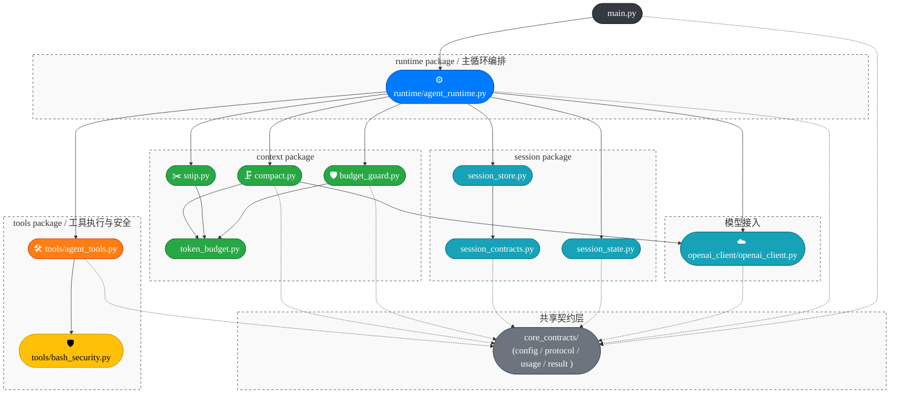

# Architecture

## 范围说明

- 本文档只描述根目录 `src/` 下当前生效的代码结构。
- 已排除工作区内嵌的 `claw-code-agent/` 目录。
- 根目录 `src/` 现在是源码根，不再作为 `src` 包名参与导入；跨目录依赖统一使用顶层绝对导入，如 `from core_contracts.config import AgentRuntimeConfig`。
- 本文档不再重复 project tree 的逐文件结构；重点是先讲清包/模块容器关系，再补少量真正影响理解的跨层依赖。

## 主视图：项目模块架构和依赖关系

逐文件结构请直接看 project tree；下面这张主图把模块分组和关键依赖放在一起，既保留容器关系，也避免把纯转发节点画进去。

这张图把模块分组和关键依赖放在一起：分组框表示模块归属，实线保留主控制流和关键调用链，虚线只表示对 `core_contracts/` 这个共享底座的契约依赖。当前最重要的三个事实是：

- `core_contracts/` 已经成为共享底座，跨模块 dataclass、JSON 协议和配置解析都从这里下沉出去。
- `openai_client/` 现在是源码根下的命名空间目录，不再依赖 `__init__.py`；具体 HTTP 与 SSE 解析仍然集中在 `openai_client/openai_client.py`。
- `context/compact.py` 是少数刻意允许跨层调用客户端的模块，因为它需要主动发起摘要压缩模型请求。

## 推荐阅读顺序

1. 先看 `core_contracts/`，建立共享契约层与配置/协议对象的边界感。
2. 再看 `openai_client/openai_client.py` 与 `tools/agent_tools.py`，理解模型侧和工具侧两个外部交互面。
3. 再看 `session/` 与 `context/`，理解状态恢复、预算治理、snip、compact 的局部职责。
4. 最后看 `runtime/agent_runtime.py` 与 `main.py`，把编排主循环和 CLI 入口串起来。