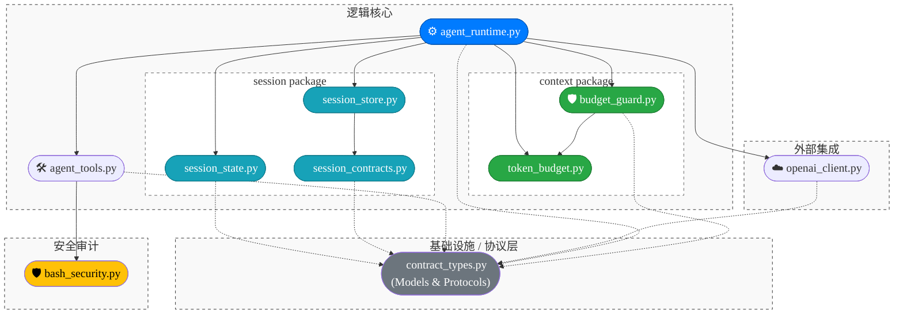

# Architecture

## 范围说明

- 本文档只分析根目录 `src` 文件夹下的 Python 文件。
- 已排除 `claw-code-agent` 文件夹下的所有文件。
- 图中每个节点代表一个文件，边 `A --> B` 表示 `A` 通过 `import/from import` 引用了 `B`。

## 文件引用关系（src）

## 快速阅读建议

- 先看 `contract_types.py`：它是核心契约层，被多个模块依赖。
- 再看 `openai_client.py` 与 `agent_tools.py`：分别是模型调用层和工具执行层。
- 然后看 `session/` 子包：`session_state.py` 维护内存态消息，`session_contracts.py` 定义落盘契约，`session_store.py` 负责 session 落盘与恢复。
- 然后看 `context/` 子包：`token_budget.py` 负责 token 投影与预算快照，`budget_guard.py` 集中管理模型调用前/后的全维度预算闸门（session_turns / model_calls / token / cost / tool_calls）。
- 最后看 `agent_runtime.py`：它把契约、模型、工具与持久化串成最小闭环；通过 `BudgetGuard` 与 `check_token_budget` 接入预算治理。
- `__init__.py` 主要负责对外导出，不承载业务逻辑。
